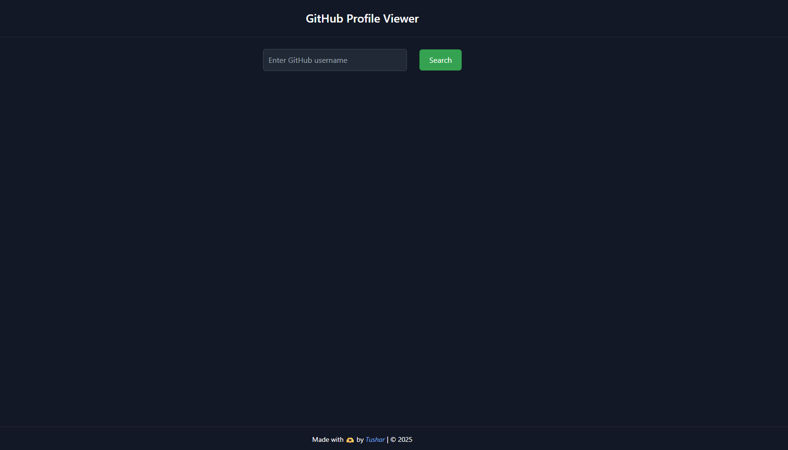
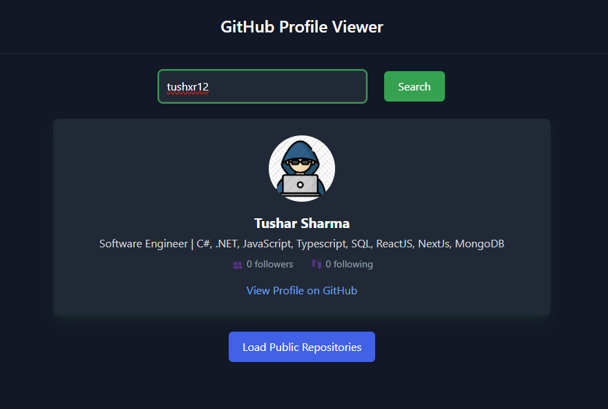
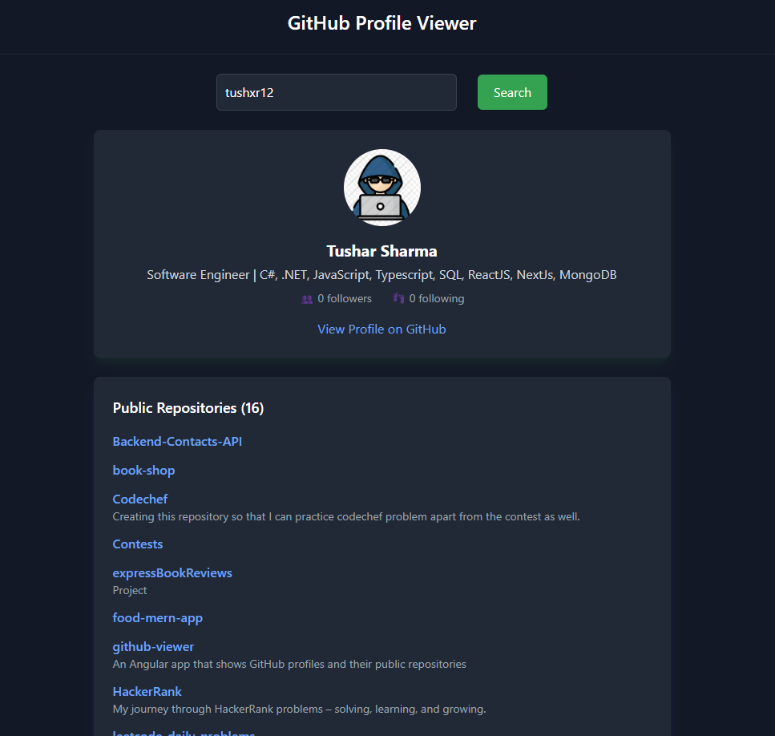

# GitHub Profile Viewer

A sleek and responsive Angular application to search and view GitHub user profiles and their public repositories.

Live Demo: [Click here to view the app](github-viewer-proj.vercel.app/)  

---

## 📸 Screenshots





---

## 🚀 Features

- 🔎 Search GitHub users by username
- 👤 View user details like name, bio, avatar, followers/following
- 📂 Load and view public repositories on demand
- ⚠️ Handles empty/invalid input and user not found scenarios
- 🎨 Clean dark-themed UI using **Tailwind CSS**
- 📱 Fully responsive and mobile-friendly
- 🧩 Modular code with Angular standalone components

---

## 🛠️ Tech Stack

- **Framework**: Angular 17 (standalone components)
- **Styling**: Tailwind CSS
- **HTTP**: Angular HttpClient
- **API**: GitHub REST API
- **Deployment**: Vercel

---

## 🧑‍💻 How to Run Locally

```bash
git clone https://github.com/your-username/github-profile-viewer.git
cd github-profile-viewer
npm install
ng serve
